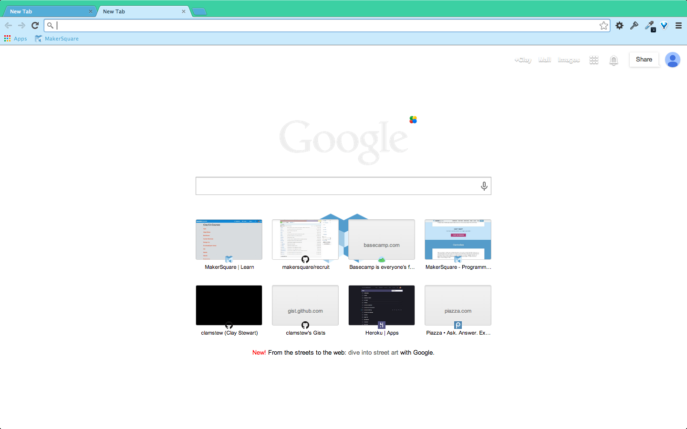

MakerSquare Chrome theme
----

A first stab a theme.

Here is a screenshot:

----

## Development:

Here is the Google official start page for themes: https://developer.chrome.com/extensions/themes

For a quick spin up of how much of this works, try going here: http://www.themebeta.com/chrome-theme-creator-online.html.  It will show you when you hover in the GUI, which property affects which part of the chrome browser window.  Then you can download the files in the **Pack** tab where it says **Pack and Download Zip File**.  Looking at the file it creates (which you may want to unuglify - http://jsbeautifier.org/) you can see what properties you choose map to the properties in the `manifest.json` files as well as how the images pull in.

Here is another sample to look at: https://github.com/greenido/Chrome-Base-Theme-Sample

To reset your theme at any point go to `chrome://settings/` and under the **Appearance** section press the button **Reset to default theme**.

#### Chrome extentions

Themes are smaller versions of chrome extensions (i.e. without html, js, css).  It only uses the `manifest.json` (required in all chrome extensions) and then whatever other images you reference in the `manifest.json` image properties.  Here is a getting started guide on chrome extensions to orient yourself: https://developer.chrome.com/extensions/getstarted

#### More on the theme properties you can edit

This resource was the most helpful and the most frustrating.  It gives really good intel on all the properties, but it didn't seem to give enough info on what values each property accepts. I did get many of them to work.  Especially with images. This is the community page: https://code.google.com/p/chromium/wiki/ThemeCreationGuide. It seems a bit out of date, since many of the images are broken, and half the properties it details don't seem to work that well.

The properties and what they do start to get outlined here: https://code.google.com/p/chromium/wiki/ThemeCreationGuide#Image_Elements in that link in the previous paragraph.

This is another helpful guide on making your own theme: https://sites.google.com/site/gsugsa/google-apps/google-chrome/how-to-create-a-theme

#### To test your edits

Go to `chrome://extensions/` in your chrome browser.  Make sure **Development mode** is checked in your browser.  Then click **Load unpacked extension...** button on the left under that checkbox.  Navigate to the route of this repo.  Then you can see your edits.  

#### Production

This theme is not there yet, but it seems trivial to host this on the chrome extensions store when we are happy with it.

##### Package your theme and publish it in one of the following ways:

1. [Upload](https://chrome.google.com/webstore/developer/dashboard) the theme to the [Chrome Web Store](https://chrome.google.com/webstore/).  This seems like the easiest option for spreadability, and it does a lot of the things in steps 2 and 3 below automagically.
2. Use Chrome to package it by yourself. More information can be found [here](https://developer.chrome.com/extensions/hosting).  To package your theme with chrome go to `chrome://extensions/` and press the **Pack Extension...** button. That will create a `Cached Theme.pak` file in the directory your working in.  It will also create two more files, `mks_chrome_theme.crx` and `mks_chrome_theme.pem`, one directory level up - which means you probably want to keep the directory with the theme in anther project directory. The `mks_chrome_theme.pem` should remain private, so if you are version contolling it.  Put `mks_chrome_theme.pem` in your `.gitignore` file.  The `mks_chrome_theme.crx` is basically the file that a user needs to click on to install the theme.  It is the type of file that google hosts on the store: [https://chrome.google.com/webstore/category/themes](https://chrome.google.com/webstore/category/themes)
3. Package it by yourself. More information can be found [here](https://developer.chrome.com/extensions/packaging).

----

## Strange things:

The **manifest version** of your `manifest.json` has to be at `2`, here's why: https://developer.chrome.com/extensions/manifestVersion.

Most of your **colors have to be in rgb**, and sometimes rgba.  Here is a converter if you find it easier to find hex values for the colors you want: http://www.javascripter.net/faq/hextorgb.htm

The images section seems to take presidence over the colors section, assuming its not the order of the json file - first one it hits.  And most of the values in the colors section did not seem to take effect.  I noted above which ones I got to work.  If anyone knows what I'm doing wrong for things like the forward, back, reload, and settings button that would be much appreciated.  Themes like this one, https://chrome.google.com/webstore/detail/caroline-gardner/hlajhhigpcohfpjjmnbifacfbdoponci, seem to pull it off, but I'm not sure what property and value they are using.  It could even be an image.  I'd like to make the this hex color: `#b13976`.

The Tints properties are not what you think - not colors.  It is explained here: https://code.google.com/p/chromium/wiki/ThemeCreationGuide#button_background

